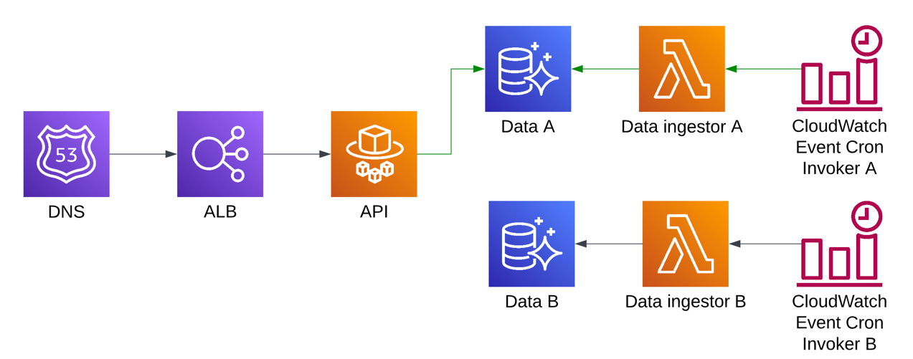

# bg-tf-ecs-demo

This is a demo of how to use Terraform to deploy an ECS fargate service using a blue/green deployment strategy through CodeDeploy.

## Architecture

## Stack overview
* TypeScript
* Terraform v1+
* AWS ECS Fargate
* AWS CodeDeploy
* AWS DynamoDB
* AWS Lambda (`nodejs18.x`)
* AWS ALB
* GitHub Actions
